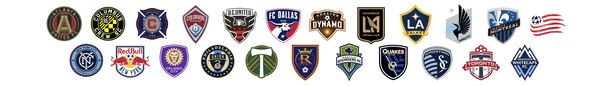

# Predicting Match Outcomes in Major League Soccer with an ELO Model

Sports are hard to predict － that much is clear... but that doesn't mean we shouldn't try. 

In case you're unfamliar with Soccer or Major League Soccer specifically, allow me to provide some context. 

Major League Soccer is an extremely young league compared to the best and oldest in the world, and despite it's rapid growth in the last decade, it still has a long way to go before it can truly compete with the best. One way in which it differs significantly from other leagues (especially the biggest European leagues) is that MLS is ultimately a single organization. Instead of a capitalistic model in which wealthy teams gain significant advantage over those with fewer resources, MLS strives to maintain a meaningful degree of parity to keep all teams competative. Of course - all sports have a large amount of chance involved and far too many unmeasurable variables to accurately predict future outcomes. Because of the balance imposed on the clubs within MLS, though, there's an even greater chance that matches end in unexpected ways. 

<!-- While the best European teams can attract and afford to have top tier talent all the way through their rosters, MLS teams are forced to be extremely careful with the money they're allowed to spend. Most teams have a handful of expensive players while the rest of the roster is filled out with less expensive talent.  -->

<!--One of the many reasons that the best leagues are as good as they are, is the availability of financial resources. They operate on capatalistic models in which the wealthiest teams have significant advantages over those with smaller budgets. For many leagues in Europe, it's simply sports capitalism. Those who can spend the most money and have the best reputation oftentimes dominate those without. The flip side is that any team that wants to play can play. They start in the lowest teir of the countries leagues and work their way up the ladder season by season. If they win, they get to move up. The hope for many teams is that their team can find the right players, and go on a miraculous run up the standings to go head to head with the best.-->

<!---Somewhat ironically, it's our American domestic league that operates on a more socialist-like structure. The league is ultimately a single organization that maintains financial and operational policies that ensure a balanced distribution of resources. This doesn't mean that there isn't some room for teams to spend more (there are of course those that do), but limitations keep lesser-funded teams at a reasonablly competitive level. While a handful of teams may struggle for a while, there is usually thriving competition in (at least) the upper two-thirds of the league. And on top of that, the teams that play poorly have ample opportunity to grow and return to high levels of play. (called clubs, because they often have multiple teams and different levels of play)---> 

So to those those foolish enough to believe that they can predict the outcomes of matches   in Major League Soccer with anything like consistency or accuracy, parity says this: "Buckle up."

In a league like this one, upsets aren't uncommon and teams who seem to be soaring over the rest can always fall unexpectedly - to the despair of their fans, who are regularly forced to question all they beleive to be true about the players they love. One week they're riding high, defeating high-quality teams on the road... and then they host a struggling team at home and lose. It's devestating... and it's beautiful. 

So let's do this.

  

## Data Sources

  

  

## Teams

  

<!-- 
<table style="border: none; border-style: none;">
<tr>
<td>

</td>

<td>

</td>

<td>

</td>

<td>

</td>

<td>

</td>
</tr>
</table> -->

<!-- 

 -->

<!--- 

# Capstone Project

Your Capstone project is the culmination of your time at GA. You will be tasked with developing an interesting question, collecting the data required to model that data, developing the strongest model (or models) for prediction, and communicating those findings to other data scientists and non-technical individuals. This introductory document lays out the five consitutent portions of the project and their due dates.

Not sure where to start? Need some inspiration? Check out some past student capstone projects at the bottom of this README: [CLICK HERE](#example-projects)

## Your Deliverables

- A well-made predictive model using either structured or unstructured machine learning techniques (or other technique approved in advanced by the global instructors), as well as clean, well-written code.
- A technical report aimed at fellow data scientists that explains your process and findings
- A public presentation of your findings aimed at laypeople.

### **[Capstone, Part 1: Topic Proposals](./01/)**

In Part 1, get started by choosing **three potential topics and problems**, describing your goals & criteria for success, potential audience(s), and identifying 1-2 potential datasets. In the field of data science, good projects are practical. Your capstone project should be manageable and affect a real world audience. This might be a domain you are familiar with, a particular interest you have, something that affects a community you are involved in, or an area that relates to a field you wish to work in.

One of the best ways to test ideas quickly is to share them with others. A good data scientist has to be comfortable discussing ideas and presenting to audiences. That's why for Part 1 of your Capstone project, you'll be preparing a lightning talk in addition to your initial notebook outlining the scope of your project.  You will present your candidate topics in a slide deck, and should be prepared to answer questions and defend your data selection(s). Presentations should take no more than 3-5 minutes.

**The ultimate choice of topic for your capstone project is yours!** However, this is research and development work. Sometimes projects that look easy can be difficult and vice versa. It never hurts to have a second (or third) option available.

- **Goal**: Prepare a 3-5 minute lightning talk that covers three potential topics, including potential sources of data, goals, metrics and audience.
- **Due**: See `course-info`

### **[Capstone, Part 2: Problem Statement + Data](./02/)**

For Part 2, provide a clear statement of the problem that you have chosen and an overview of your approach to solving that problem. Summarize your objectives, goals & success metrics, and any risks & assumptions. Outline your proposed methods and models. **Your data should be in hand by this point in the process!**

**Again, your data should be in hand by this point the process!**

- **Goal**: Gather your data and describe your proposed approach to your local instructor.
- **Due**: See `course-info`

### **[Capstone, Part 3: Progress Report + Preliminary Findings](./03/)**

In Part 3, you'll create a progress report of your work in order to get feedback along the way. Describe your approach, initial EDA, initial results, and any setbacks or lessons learned so far. Your report should include updated visual and statistical analysis of your data. You’ll also meet with your local instructional team to get feedback on your results so far!

- **Goal**: Discuss progress and setbacks, include visual and statistical analysis, review with instructor.
- **Due**: See `course-info`

### **[Capstone, Part 4: Report Writeup + Technical Analysis](./04/)**

By now, you're ready to apply your modeling skills to make machine learning predictions. Your goal for Part 4 is to develop a technical document (in the form of Jupyter notebook) that can be shared among your peers.

Document your research and analysis including a summary, an explanation of your modeling approach as well as the strengths and weaknesses of any variables in the process. You should provide insight into your analysis, using best practices like cross validation or applicable prediction metrics.

- **Goal**: Detailed report and code with a summary of your statistical analysis, model, and evaluation metrics.
- **Due**: See `course-info`

### **[Capstone, Part 5: Presentation + Recommendations](./05/)**

Whether during an interview or as part of a job, you will frequently have to present your findings to business partners and other interested parties - many of whom won't know anything about data science! That's why for Part 5, you'll create a presentation of your previous findings with a non-technical audience in mind.

You should already have the analytical work complete, so now it's time to clean up and clarify your findings. Come up with a detailed slide deck or interactive demo that explains your data, visualizes your model, describes your approach, articulates strengths and weaknesses, and presents specific recommendations. Be prepared to explain and defend your model to an inquisitive audience!

- **Goal**: Detailed presentation deck that relates your data, model, and findings to a non-technical audience.
- **Due**: See `course-info`

### Example Projects

Below are some great capstone projects submitted by past DSI students!
* [Brian Kane's Capstone](https://github.com/BrianLKane/capstone)
* [A fruit and vegetable classifier](https://github.com/irinhwng/Image-Classification-of-Fruits-and-Vegetables)
* [Heather Johansen](https://github.com/heatherjogo/Cake_Pricing_Tool), who has a small baking business she runs on the side, estimates the price of a cake from an image of a cake
* [Jesse Tao](https://github.com/jesseptao/spotify-recommender) built his own spotify recommender system
* [Kenya Chauche, DSI-10](https://github.com/KenyaChauche/sonnet-generation) built a natural language generation program trained on Shakespeare's sonnets
* [Molly Baird, DSI-11](https://github.com/mollycbaird/ComputerVisionSET) wanted to computerize the game of SET, and succeeded admirably
* [Daniel Johnston, DSI-2](https://github.com/djkjohnston/ML_from_scratch_GA_DSI_Capstone) built several key machine learning algos from scratch in python, comparing their performance to the scikit-learn implementations.  
* [Alex Schultz, DSI-3](https://github.com/fullquartpress/DSI-Capstone) predicts spot coffee (commodity coffee bean) price changes from sentiment analysis of an industry trade publication.  
* [Brice Walker, DSI-3](https://github.com/bricewalker/Hey-Jetson) wanted to play with his Jetson GPU and built voice transcription _from scratch_.  
* [Caitlin Streamer, DSI-4](https://github.com/c-streams/Pneumonia) worked on a Kaggle dataset to predict pneumonia from chest X-rays.  
* [Brian Osgood, DSI-04](https://github.com/osgoodbl/PyFilter) built a bot that crawls twitter and identifies whether an image tagged 'lamborghini' is actually a lamborghini.  
* [Frank Turner, DSI-04](https://github.com/frankturnerv/Fashioning_Models_from_Fashion_Models) uses image recognition to identify the colors used in a fashion season's palette.  
* [DSI-06, team](https://github.com/balak4/Optimizing-Evac-Routes) This is actually the DSI-6 group project. It's here because it's really, really impressive.  
* [Amy Taylor, DSI-06](https://github.com/amytaylor330/CNN_for_Dance_Music_Classification_repost) wanted to quantify the difference between types of dance music.  
* [Veronica Giannotta, DSI-06](https://github.com/vgiannotta/Emotional-Impacts-of-Viral-Content) delved into the dark side of the internet and evaluated the emotional sentiment of social media content that goes viral.
* [Derek Steffan, DSI-07](https://github.com/dsteffan/twitch_chat_analysis) automates the process of creating twitch highlight reels using sentiment analysis, markov chains, and Bayesian analysis.  
* [Sebastian Alvis, League of Legends](https://github.com/salvis2/SpringboardAlvis/tree/master/capstone_project_1) Not a GA capstone, but a very compelling case for applying data science to your interests to come up with a good capstone.
* [Non-repo capstone projects](https://gallery.generalassemb.ly/DSI?metro=)

-->
